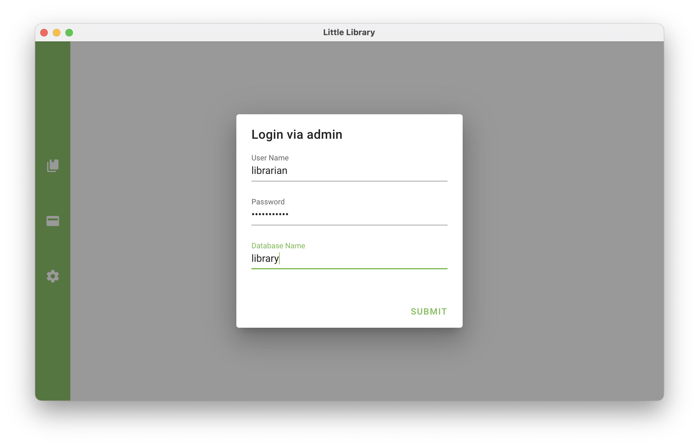
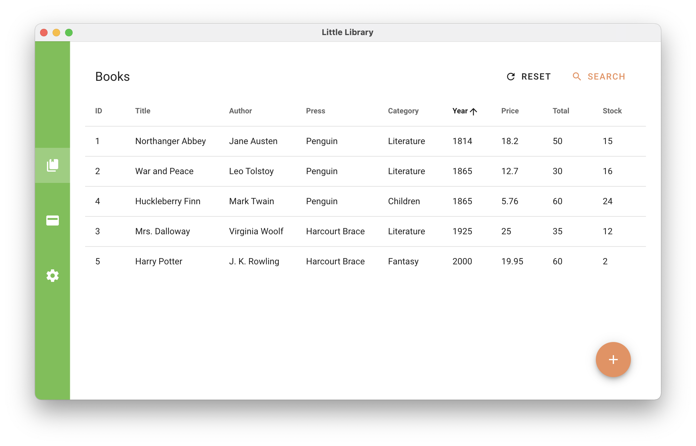
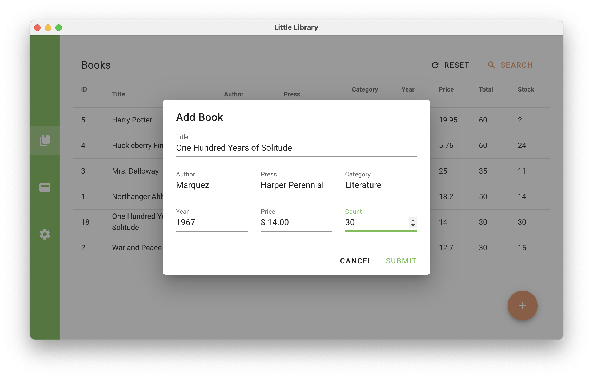
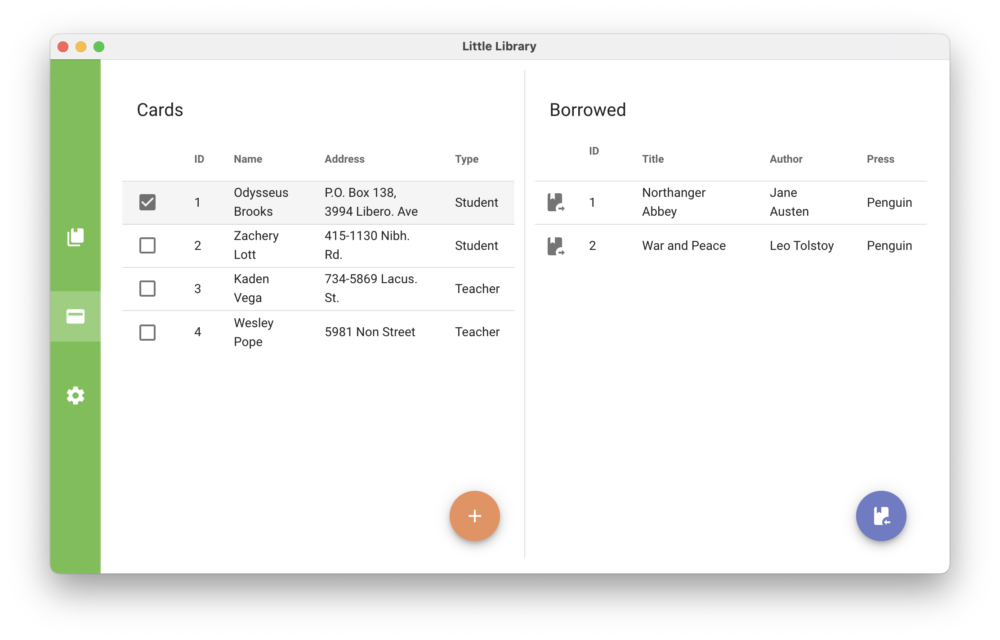
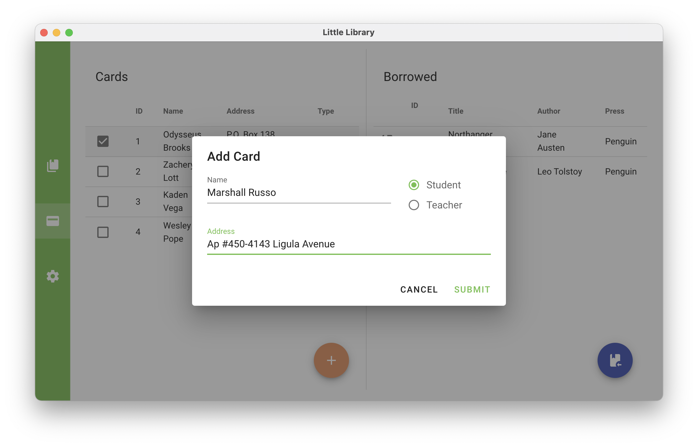
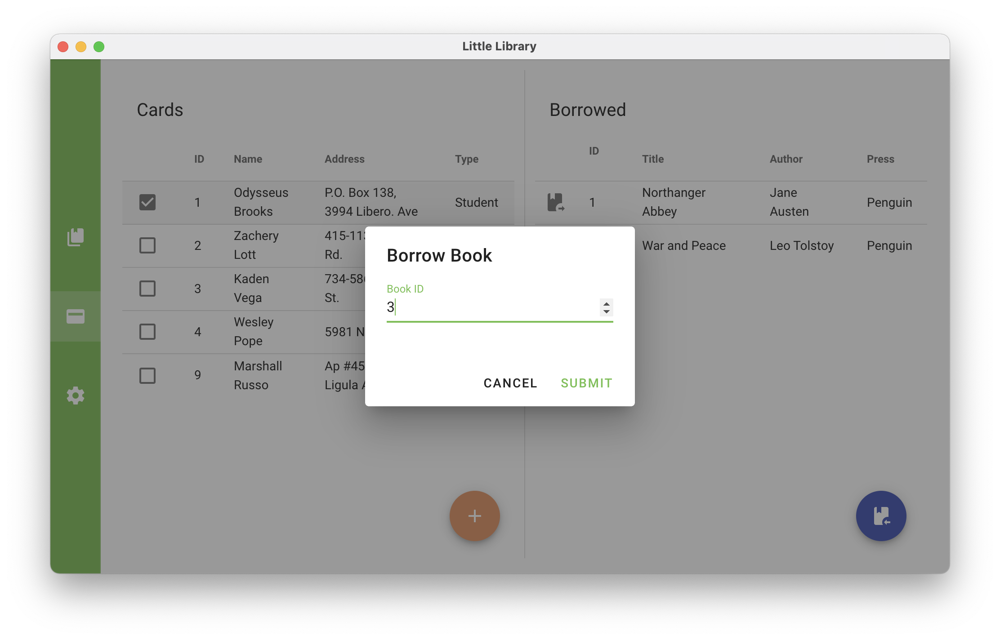
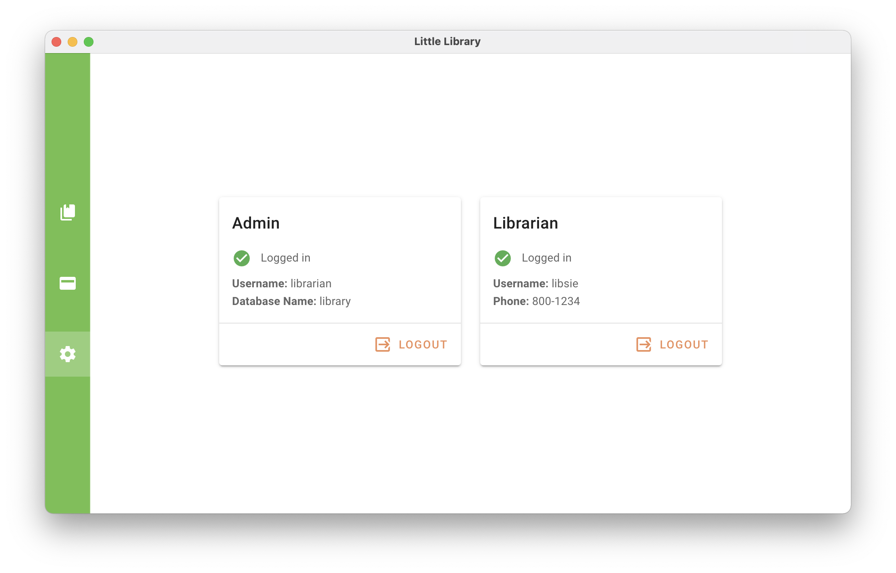

# little-library-app

A little library management system based on MySQL.
This repo provides a cross-platform App interface, proudly powered by Vue.js and Electron.js.
The core logic interfacing MySQL database depends on [`little-library`](https://github.com/frothywater/little-library). CLI is also provided by [`little-library-cli`](https://github.com/frothywater/little-library-cli).

## Declaration

This project as a coursework of _Database Manage System_ fully belongs to @frothywater.

## Usage

(with customizable sorting options)

