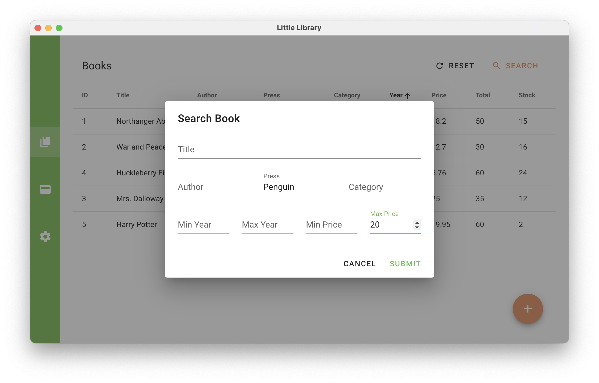

# little-library-app

A little library management system based on MySQL.
This repo provides a cross-platform App interface, proudly powered by Vue.js and Electron.js.

Declaration: This project as a coursework of _Database Manage System_ fully belongs to @frothywater.

## Usage

(with customizable sorting options)

